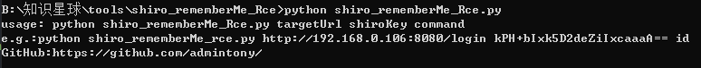
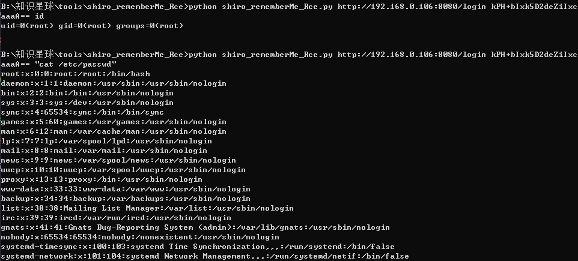

# shiro_rememberMe_Rce

## 描述

利用长亭xray高级版的回显Gadget重写的一个shiro反序列化利用工具。

## 用法

建议先用其他工具找到可以利用的shiro密码，然后使用此工具进行利用。

```
python shiro_rememberMe_Rce.py targetUrl shiroKey command
python shiro_rememberMe_rce.py http://192.168.0.106:8080/login kPH+bIxk5D2deZiIxcaaaA== id
```





## 更新说明

v0.1版本：
- 实现用CommonsCollectionsK1这个gadget执行命令

v0.2版本：
- 添加有新的回显gadget，共6个
- 添加自动枚举可用的gadget功能

## 参考

参考文章[shiro新姿势：初探xray高级版shiro插件](https://www.anquanke.com/post/id/211228)
